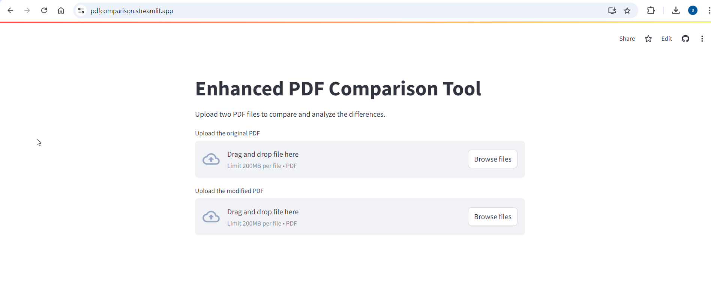

# PDF Comparison Tool

This PDF Comparison Tool is a Streamlit web application that allows users to compare two PDF files, highlighting the differences and providing a detailed change log. It's designed to make document comparison easy and accessible through a user-friendly interface.

## Features

- Upload and compare two PDF files
- Visual highlighting of differences in an annotated PDF
- Detailed change log summarizing all modifications
- Download options for both the annotated PDF and change log
- Persistent results until the user chooses to start a new comparison
- Advanced semantic comparison using NLP techniques
- Verification of changes to reduce false positives

## Installation

1. Clone this repository:

   ```
   git clone https://github.com/adataguy-ai/pdfcomparison.git
   cd pdf-comparison-tool
   ```

2. Create a virtual environment (optional but recommended):

   ```
   python -m venv .venv
   source .venv/bin/activate  # On Windows, use `.venv\Scripts\activate`
   ```

3. Install the required dependencies:
   ```
   pip install -r requirements.txt
   ```

## Docker Build and Run Process

To containerize and run the PDF Comparison Tool, follow these steps:

Prerequisites
Ensure that you have Docker installed on your machine.

Steps to Build and Run the Docker Container

1. Clone the repository (if not already done):

```
git clone https://github.com/adataguy-ai/pdfcomparison.git
cd pdf-comparison-tool
```

2. Build the Docker image:
   In the root of the project directory (where the Dockerfile is located), run the following command to build the Docker image:

```
docker build -t pdf-comparison-tool .
```

This command will:

- Pull the required Python base image.
- Copy the necessary files into the container.
- Install the dependencies from requirements.txt.

3. Run the Docker container:
   After the Docker image is built, you can run the container with the following command:

```
docker run -p 8501:8501 pdf-comparison-tool
```

This command will:

- Start the container.
- Expose the application on port 8501, which is the default port for Streamlit.

4. Access the application:
   Open your web browser and go to http://localhost:8501. The PDF Comparison Tool should be running and accessible through the web interface.

5. Stop the container:
   To stop the container, press CTRL+C in the terminal where the container is running, or use the following command to stop and remove the container:

```
docker ps  # Find the container ID
docker stop <container-id>  # Stop the container
docker rm <container-id>  # Remove the container
```

## Usage

1. Run the Streamlit app:

   ```bash
   streamlit run app.py
   ```

2. Open your web browser and navigate to the URL provided by Streamlit (usually `http://localhost:8501`).

3. Use the interface to:
   - Upload two PDF files for comparison
   - Initiate the comparison process
   - View the annotated PDF and change log
   - Download the results

## How it Works

The PDF Comparison Tool uses the `EnhancedPDFComparer` class (implemented in `pdf_compare.py`) to analyze and compare the uploaded PDF files. The comparison process involves:

1. Extracting text blocks from both PDFs
2. Generating semantic embeddings for each text block
3. Comparing embeddings to detect potential changes
4. Verifying detected changes using a zero-shot classification model
5. Generating an annotated PDF highlighting the differences
6. Creating a detailed change log

The Streamlit app provides a user-friendly interface for this process and allows users to easily view and download the results.

### Model Choices and Their Rationale

1. **Embedding Model: "sentence-transformers/all-MiniLM-L6-v2"**

   - Used for generating semantic embeddings of text blocks
   - Allows for detection of changes based on meaning, not just exact word matches
   - Balanced performance and efficiency

2. **Verification Model: "facebook/bart-large-mnli"**
   - Used in a zero-shot classification pipeline to verify detected changes
   - Helps reduce false positives by understanding textual entailment and contradiction
   - Provides confidence scoring for prioritizing changes

### Verification Process

The verification step acts as a "second opinion" in the change detection process:

- Reduces false positives by filtering out insignificant variations
- Considers the context of the change
- Handles paraphrasing and restatements
- Provides confidence scoring for each verified change

### Handling Complex PDFs

The current implementation has some limitations:

- Does not perform OCR (Optical Character Recognition)
- Cannot directly analyze images or parse charts
- Detects changes in textual content associated with visual elements, but doesn't understand the visual representations

Future enhancements could include:

- Integration of OCR capabilities
- Image comparison algorithms
- Specialized chart and graph parsing tools

## Dependencies

- streamlit
- PyMuPDF (fitz)
- transformers
- torch
- spacy
- scikit-learn
- Other dependencies as specified in `requirements.txt`

## Contributing

Contributions to improve the PDF Comparison Tool are welcome. Please feel free to submit issues or pull requests.

## Hosted App

This app is also available on Streamlit's public cloud at https://pdfcomparison.streamlit.app/



## Contact

For any queries or suggestions, please open an issue on the GitHub repository.

## License

[GNU General Public License v3.0](https://www.gnu.org/licenses/gpl-3.0.en.html)
